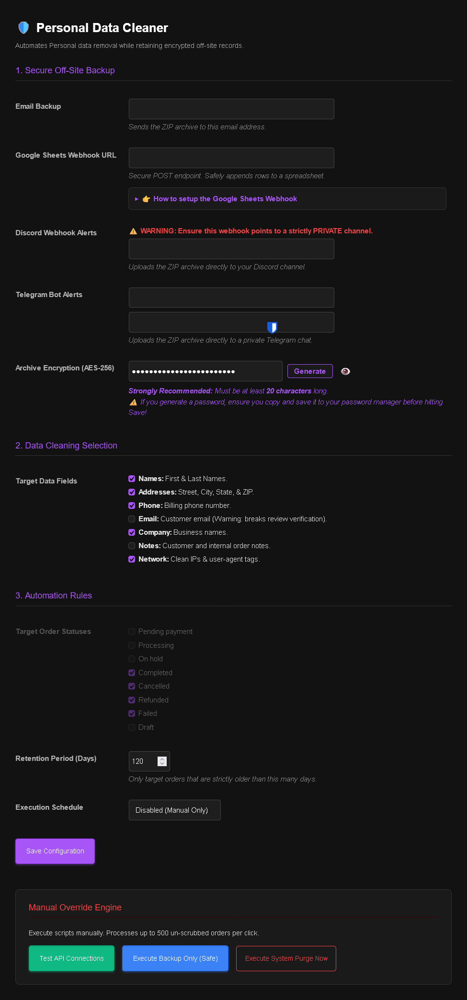
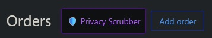
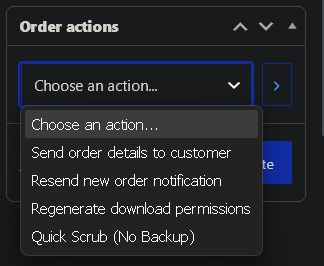

Full disclosure. I used Gemini pro to make this snippet and the readme. I've tested to make sure everything works.

# WooCommerce Privacy Cleaner & Compliance Archiver

A lightweight, zero-dependency PHP snippet for WooCommerce that automatically scrubs Personal Identifiable Information (PII) from old orders while securely pushing encrypted, off-site backups via Webhooks (Discord, Telegram, Google Sheets) and Email. 

Designed for store owners who want to maintain strict data privacy (GDPR/CCPA compliance) without losing their financial and auditing records.

## Features
* **Zero-Storage Policy:** Generates backups, transmits them over API, and instantly runs `unlink()` to destroy the physical files from your server. No sensitive data is left sitting in your `wp-content` folders.
* **AES-256 ZIP Encryption:** Wraps CSV backups in AES-256 encrypted `.zip` archives before transmission. If your Discord, Telegram, or Email gets compromised, your data remains locked. Built-in secure password generator included.
* **Multi-Channel Off-Site Backups:**
  * **Google Sheets Webhook:** Appends order data row-by-row via a secure JSON payload (no direct database/API keys required).
  * **Discord:** Uploads the encrypted ZIP to a private channel via Webhook.
  * **Telegram:** Delivers the encrypted ZIP directly to a private chat or group via Bot API.
  * **Email:** Sends the encrypted archive directly to your inbox.
* **Granular Retention Rules:** Set an exact retention period (e.g., 30 days) so you maintain full customer data during the refund/chargeback window before the scrub triggers.
* **Dark-Mode UI:** A clean, native settings dashboard seamlessly integrated into your WordPress admin panel under **Tools > Privacy Cleaner**.
* **Failsafes & Testing:** Includes a "Test API Connections" button to verify your webhooks with dummy data, and a "Backup Only" manual override to pull data without deleting anything.

## Installation

You do not need to install this as a plugin. It is designed to run as a standalone snippet. There are two ways to install it:

### Method A: 1-Click Import (Fluent Snippets)
If you use the free [Fluent Snippets](https://wordpress.org/plugins/fluent-snippets/) plugin, you can import the pre-configured script instantly.
1. Download the `privacy-cleaner.json` file from this repository.
2. In your WordPress dashboard, go to **Fluent Snippets > Import**.
3. Upload the `.json` file and click **Import Snippets**.
4. Toggle the snippet to **Active**.
5. Navigate to **Tools > Privacy Cleaner** to configure your settings.

### Method B: Manual Installation
1. Install a code snippet manager like Fluent Snippets or WPCode.
2. Create a new PHP snippet.
3. Paste the entire contents of `privacy-cleaner.php`.
4. Save and activate the snippet.
5. Navigate to **Tools > Privacy Cleaner** to configure your settings.

## Requirements
* **WooCommerce:** Tested and required.
* **PHP `ZipArchive` Extension:** Required to generate the `.zip` files and apply AES-256 encryption. (Enabled by default on 99% of modern web hosts).

## Google Sheets Webhook Setup
To safely push data to Google Sheets without exposing your WordPress site to direct Google API keys, this snippet uses a custom Google Apps Script as a webhook receiver.

1. Go to Google Drive and create a new blank Google Sheet.
2. In the top menu, click **Extensions > Apps Script**.
3. Delete the default code and paste the script below into the editor:

```
function doPost(e) {
  try {
    var sheet = SpreadsheetApp.getActiveSpreadsheet().getActiveSheet();
    var data = JSON.parse(e.postData.contents);
    
    if (sheet.getLastRow() === 0) {
      sheet.appendRow(["Order ID", "Date", "First Name", "Last Name", "Email", "Phone", "Address", "City", "State", "Zip", "Total"]);
    }
    
    data.forEach(function(order) {
      sheet.appendRow([order.id, order.date, order.first_name, order.last_name, order.email, order.phone, order.address, order.city, order.state, order.postcode, order.total]);
    });
    
    return ContentService.createTextOutput(JSON.stringify({"status": "success"})).setMimeType(ContentService.MimeType.JSON);
  } catch(error) {
    return ContentService.createTextOutput(JSON.stringify({"status": "error", "message": error.toString()})).setMimeType(ContentService.MimeType.JSON);
  }
}

```

4. Click **Deploy > New deployment** in the top right.
5. Click the gear icon next to "Select type" and choose **Web app**.
6. Set "Execute as" to **Me** and "Who has access" to **Anyone**.
7. Click **Deploy**, authorize the permissions, and copy the generated **Web App URL**.
8. Paste that URL into the Privacy Cleaner settings in WordPress.


## Telegram Bot & Chat ID Setup

To receive backups in Telegram, you need two items: a **Bot Token** and your **Chat ID**.

### 1. Get Your Bot Token
1. Open Telegram and search for [@BotFather](https://t.me/BotFather).
2. Send `/newbot` and follow the prompts to choose a display name and username (the username must end in `bot`, e.g., `MyStoreBackup_bot`).
3. BotFather will provide an HTTP API token (formatted like `123456789:ABCdefGhIJKlmNoPQRsTUVwxyZ`). Copy this token.

### 2. Get Your Chat ID
You can receive backups in a direct private message or in a private group.

* **For Direct Private Messages (Recommended):**
  1. Open your newly created bot in Telegram and click **Start** (or send `/start`).
  2. Search for [@userinfobot](https://t.me/userinfobot) on Telegram and click **Start**.
  3. It will immediately reply with your numeric **Id** (e.g., `123456789`).

* **For Private Groups:**
  1. Create a private group and add your bot to it.
  2. Add [@RawDataBot](https://t.me/RawDataBot) to the group.
  3. Locate the `chat` object in the raw output and copy the `id` (group IDs typically start with a minus sign, e.g., `-1001234567890`).
  4. Remove `@RawDataBot` from the group.

Paste the **Bot Token** and **Chat ID** into the Privacy Cleaner settings under **Telegram Bot Alerts**.


## Security Warning for Discord/Telegram

If you utilize the Discord Webhook or Telegram Bot integrations, **ensure they're pointing to strictly private channels/chats**.  
Even though the archives are AES-256 encrypted, you should never broadcast customer PII payloads into public or shared spaces.

## Usage

* **Automated Cron:** Once configured, the engine runs silently in the background (Daily or Weekly) based on your schedule.
* **Manual Purge:** Use the red "Execute System Purge Now" button in the settings to process up to 500 eligible orders instantly.
* **Test API Connections:** Use the green test button to push a fake order payload (`TEST-001`) to all active integrations to verify your webhooks and tokens are functioning properly.
* **Quick Scrub:** A new action is added to the "Single Order Actions" dropdown on individual WooCommerce order pages, allowing you to instantly scrub a specific order bypassing the backup system entirely.


# Pictures  

## Settings:  

  

## Shortcut:  

  

## Quick Scrub:  

  
